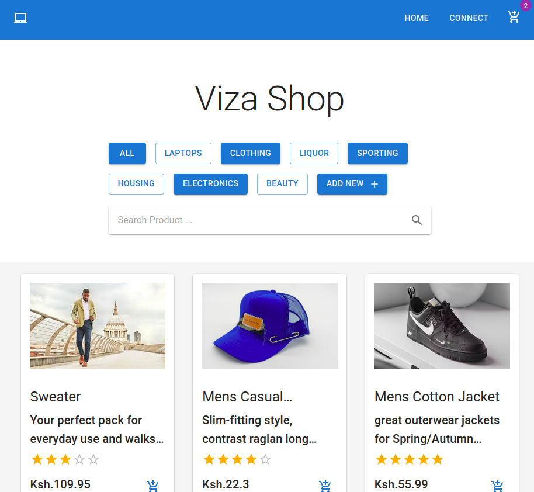
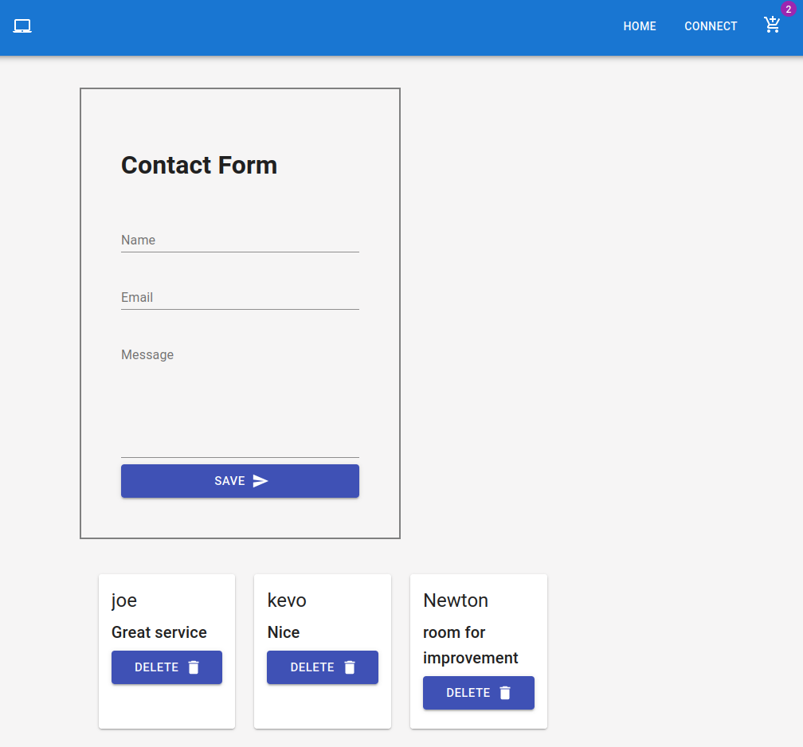

# Title

> > Costamay STORE

# Description

> > With the current generation where everything is acquired online , Costamay Store serves the same purpose. Access all available products and amazing prises at the comfort of your place. The Project tends to reduce the hustle of having to go to a physical shop. Its also a great deal to the shop owner who doesn't have to set up physical traditional store with may result to more cost at the same time providing a greater market range

# Visuals

>> HOME PAGE

>> CONNECT PAGE

# 🛠 Skills

> > - React Js , HTML , CSS, Material UI for the front End
> > - Working with JSON Server for Back-End

# Features

> > - Add New products
> > - Update the cart
> > - Add and edit customer details
> > - Submit Feedback

# Setup requirements

- git (https://git-scm.com/)
- Web browser of your choice
- Github (https://github.com/)
- Node.js (https://nodejs.org/)
- NPM (https://www.npmjs.com/)

# Installation

> > Note that the project requires external dependencies such as material UI

1. You need to clone the project
   > > Clone the Repository
2. To install the Node Modules run
   > > npm install
3. If the intallation leads to any error run the command with --force as below
   > > npm install --force

# GitHub Code

> > [@Costamay store Github Repo]()

# LIve Link

# Support

> > For any support concerning the project
> > [@Email](titusouko@gmail.com)

# Contributing

> > Contributions are always welcome!Please adhere to this project's `code of conduct`.

# Authors

> > - [@costamay](https://github.com/costamay/)

# Feedback

> > If you have any feedback, please reach out to us at [@Email](titusouko@gmail.com)

# Tech Stack

> > **Client:** HTML, CSS, ReactJs, Material UI

> > **Server:** Json-Server

# Project status

> > No known errors and the project is working fine

# License

> > [MIT](https://choosealicense.com/licenses/mit/)
